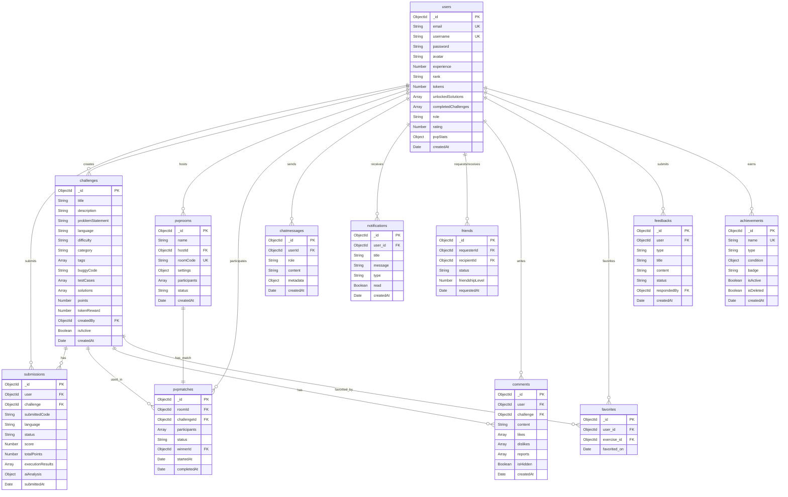

# Thiết kế Cơ Sở Dữ Liệu - BugHunter

Tài liệu này mô tả chi tiết thiết kế cơ sở dữ liệu MongoDB cho hệ thống BugHunter - Nền tảng học lập trình thông qua việc tìm và sửa lỗi code.

---

## Tổng quan

### Loại CSDL
- **Database**: MongoDB (NoSQL Document Database)
- **ODM**: Mongoose
- **Collections**: 14 collections chính

### Đặc điểm
- Schema-based với Mongoose validation
- Hỗ trợ relationships qua ObjectId references
- Indexes được tối ưu cho queries thường xuyên
- Embedded documents cho data có quan hệ 1-nhiều chặt chẽ
- Soft delete cho một số collections quan trọng

---

## 1. Collection: **users**

### Mô tả
Lưu trữ thông tin người dùng, profile, thống kê, và cài đặt cá nhân.

### Schema

```javascript
{
  _id: ObjectId,
  email: String,                    // Unique, required
  username: String,                 // Unique, required, min 3 chars
  password: String,                 // Hashed with bcrypt, select: false
  resetCode: String,                // Mã reset password (select: false)
  resetCodeExpires: Date,           // Thời hạn reset code
  avatar: String,                   // URL ảnh đại diện
  phone: String,                    // Số điện thoại (unique, sparse index)
  favoriteLanguages: [String],      // ['Python', 'JavaScript', 'Java', 'C++', 'C#', 'C']
  experience: Number,               // Tổng XP (default: 0)
  rank: String,                     // 'Newbie' | 'Junior' | 'Intermediate' | 'Senior' | 'Expert'
  badges: [String],                 // Danh sách badges đã đạt được
  tokens: Number,                   // Số token hiện có (default: 0, min: 0)
  
  // Unlocked solutions (embedded array)
  unlockedSolutions: [{
    challengeId: ObjectId,          // Ref: Challenge
    solutionIndex: Number,          // Thứ tự solution đã unlock
    unlockedAt: Date                // Thời gian unlock (default: now)
  }],
  
  // Completed challenges (embedded array)
  completedChallenges: [{
    challengeId: ObjectId,          // Ref: Challenge
    completedAt: Date,              // Thời gian hoàn thành
    maxScoreAchieved: Number,       // Điểm cao nhất đạt được
    tokenAwarded: Boolean           // Đã nhận token chưa (default: false)
  }],
  
  // Authentication
  loginMethod: String,              // 'local' | 'google' | 'github' | 'facebook'
  oauth: {
    google: String,                 // OAuth ID
    github: String,
    facebook: String
  },
  
  // Authorization
  role: String,                     // 'user' | 'moderator' | 'admin' (default: 'user')
  isBanned: Boolean,                // Có bị ban không (default: false)
  banReason: String,                // Lý do ban
  bannedUntil: Date,                // Thời hạn ban
  
  // PvP Fields
  rating: Number,                   // Elo rating (default: 1200, min: 0)
  level: Number,                    // Level người chơi (default: 1, min: 1)
  pvpStats: {
    wins: Number,                   // Số trận thắng
    losses: Number,                 // Số trận thua
    draws: Number,                  // Số trận hòa
    totalMatches: Number,           // Tổng số trận
    winRate: Number,                // Tỷ lệ thắng (%)
    currentStreak: Number,          // Chuỗi thắng hiện tại
    bestStreak: Number,             // Chuỗi thắng tốt nhất
    averageCompletionTime: Number   // Thời gian trung bình hoàn thành (ms)
  },
  
  // User Settings
  settings: {
    background: {
      id: String,
      url: String,
      label: String
    }
  },
  
  createdAt: Date,                  // Timestamp tạo
  updatedAt: Date                   // Timestamp cập nhật
}
```

### Indexes
```javascript
email: unique
username: unique
phone: unique (sparse)
```

### Methods
- `comparePassword(candidatePassword: string): Promise<boolean>` - So sánh mật khẩu

### Middleware
- Pre-save hook: Hash password với bcrypt nếu password được modified

---

## 2. Collection: **challenges**

### Mô tả
Lưu trữ các bài tập lập trình, bao gồm đề bài, test cases, solutions mẫu.

### Schema

```javascript
{
  _id: ObjectId,
  title: String,                    // Tiêu đề (required, max 200 chars)
  titleEn: String,                  // Tiêu đề tiếng Anh (optional)
  description: String,              // Mô tả ngắn (required)
  descriptionEn: String,            // Mô tả tiếng Anh (optional)
  problemStatement: String,         // Đề bài chi tiết (required)
  problemStatementEn: String,       // Đề bài tiếng Anh (optional)
  language: String,                 // Ngôn ngữ (required, enum)
  difficulty: String,               // 'Easy' | 'Medium' | 'Hard' (required)
  category: String,                 // 'Syntax' | 'Logic' | 'Performance' | 'Security'
  tags: [String],                   // Tags mô tả (array)
  buggyCode: String,                // Code có lỗi làm starter code (default: '')
  correctCode: String,              // Code đúng (optional, không bắt buộc)
  
  // Test Cases (embedded array)
  testCases: [{
    input: String,                  // Input cho test case (required)
    expectedOutput: String,         // Output mong đợi (required)
    isHidden: Boolean,              // Test case ẩn không? (default: false)
    points: Number                  // Điểm cho test case này (default: 10)
  }],
  
  // Solutions mẫu (embedded array)
  solutions: [{
    title: String,                  // Tiêu đề solution (required)
    code: String,                   // Code solution (required)
    explanation: String,            // Giải thích (required)
    language: String,               // Ngôn ngữ (required)
    tokenCost: Number,              // Giá token để unlock (default: 10)
    order: Number                   // Thứ tự hiển thị (default: 0)
  }],
  
  points: Number,                   // Điểm tối đa (required, min: 1, max: 1000)
  tokenReward: Number,              // Token thưởng khi hoàn thành (default: 1, min: 0)
  timeLimit: Number,                // Giới hạn thời gian (seconds, min: 1, max: 60)
  memoryLimit: Number,              // Giới hạn bộ nhớ (MB, min: 1, max: 512)
  isActive: Boolean,                // Challenge còn active không (default: true)
  createdBy: ObjectId,              // Ref: User (người tạo, required)
  createdAt: Date,
  updatedAt: Date
}
```

### Indexes
```javascript
{ language: 1, difficulty: 1, isActive: 1 }    // Composite index
{ category: 1, tags: 1 }                        // Composite index
{ createdBy: 1 }                                // Single index
```

### Validation
- `language`: Enum ['Python', 'JavaScript', 'Java', 'C++', 'C#', 'C']
- `difficulty`: Enum ['Easy', 'Medium', 'Hard']
- `category`: Enum ['Syntax', 'Logic', 'Performance', 'Security']
- `title`: Max 200 characters
- `points`: Min 1, Max 1000
- `timeLimit`: Min 1, Max 60
- `memoryLimit`: Min 1, Max 512

---

## 3. Collection: **submissions**

### Mô tả
Lưu trữ các lần nộp bài của user, bao gồm code, kết quả chạy, và phân tích AI.

### Schema

```javascript
{
  _id: ObjectId,
  user: ObjectId,                   // Ref: User (required)
  challenge: ObjectId,              // Ref: Challenge (required)
  submittedCode: String,            // Code user submit (required)
  language: String,                 // Ngôn ngữ (required, enum)
  status: String,                   // Trạng thái submission (required, enum)
  score: Number,                    // Điểm đạt được (default: 0, min: 0)
  totalPoints: Number,              // Tổng điểm của challenge (required, min: 0)
  
  // Execution Results (embedded array)
  executionResults: [{
    testCaseIndex: Number,          // Thứ tự test case (required)
    input: String,                  // Input (required)
    expectedOutput: String,         // Output mong đợi (required)
    actualOutput: String,           // Output thực tế (required)
    passed: Boolean,                // Test case pass không? (required)
    executionTime: Number,          // Thời gian chạy (ms, required)
    memoryUsed: Number,             // Bộ nhớ dùng (KB, required)
    errorMessage: String,           // Error message (optional)
    points: Number                  // Điểm đạt được (required, default: 0)
  }],
  
  executionTime: Number,            // Tổng thời gian chạy (ms, default: 0)
  memoryUsed: Number,               // Peak memory usage (KB, default: 0)
  errorMessage: String,             // Error message tổng thể (optional)
  
  // AI Analysis (embedded document)
  aiAnalysis: {
    overallStatus: String,          // 'correct' | 'partial' | 'incorrect'
    score: Number,
    totalPoints: Number,
    summary: String,                // Tóm tắt kết quả
    recommendations: [String],      // Khuyến nghị
    learningPoints: [String],       // Điểm học tập
    
    errorAnalyses: [{               // Phân tích lỗi
      errorType: String,            // 'syntax' | 'logic' | 'runtime' | 'performance' | 'timeout' | 'memory' | 'other'
      errorMessage: String,
      errorLocation: {
        line: Number,
        column: Number,
        codeSnippet: String
      },
      severity: String,             // 'low' | 'medium' | 'high' | 'critical'
      description: String
    }],
    
    codeSuggestions: [{             // Gợi ý sửa code
      line: Number,
      currentCode: String,
      suggestedCode: String,
      explanation: String,
      confidence: Number            // 0-1
    }],
    
    testCaseAnalyses: [{            // Phân tích từng test case
      testCaseIndex: Number,
      passed: Boolean,
      input: String,
      expectedOutput: String,
      actualOutput: String,
      errorMessage: String,
      analysis: String,
      hints: [String]
    }]
  },
  
  submittedAt: Date,                // Thời gian submit (default: now)
  createdAt: Date,
  updatedAt: Date
}
```

### Indexes
```javascript
{ user: 1, challenge: 1 }               // Composite index
{ user: 1, submittedAt: -1 }            // Composite index
{ challenge: 1, submittedAt: -1 }       // Composite index
{ status: 1, submittedAt: -1 }          // Composite index
```

### Validation
- `language`: Enum ['Python', 'JavaScript', 'Java', 'C++', 'C#', 'C']
- `status`: Enum ['Pending', 'Running', 'Accepted', 'Wrong Answer', 'Time Limit Exceeded', 'Memory Limit Exceeded', 'Runtime Error', 'Compilation Error']

---

## 4. Collection: **pvprooms**

### Mô tả
Lưu trữ thông tin về các phòng PvP (Player vs Player).

### Schema

```javascript
{
  _id: ObjectId,
  name: String,                     // Tên phòng (required, max 50 chars)
  hostId: ObjectId,                 // Ref: User (host của room, required)
  hostUsername: String,             // Tên host (required)
  roomCode: String,                 // Mã phòng 6 ký tự (required, unique, uppercase)
  
  // Room Settings (embedded document)
  settings: {
    timeLimit: Number,              // Giới hạn thời gian (minutes, min: 5, max: 60, default: 15)
    difficulty: String,             // 'Easy' | 'Medium' | 'Hard' (default: 'Medium')
    maxParticipants: Number,        // Số người tối đa (min: 2, max: 8, default: 2)
    isPrivate: Boolean,             // Phòng riêng tư không (default: false)
    language: String                // Ngôn ngữ (default: 'javascript')
  },
  
  // Participants (embedded array)
  participants: [{
    userId: ObjectId,               // Ref: User (required)
    username: String,               // Tên user (required)
    joinedAt: Date,                 // Thời gian join (default: now)
    isReady: Boolean                // Đã sẵn sàng chưa (default: false)
  }],
  
  status: String,                   // 'waiting' | 'in-progress' | 'completed' (default: 'waiting')
  createdAt: Date,
  updatedAt: Date
}
```

### Indexes
```javascript
{ roomCode: 1 }                         // Unique index
{ status: 1, createdAt: -1 }            // Composite index
{ hostId: 1 }                           // Single index
```

### Static Methods
- `generateRoomCode(): string` - Generate unique 6-character room code

### Instance Methods
- `addParticipant(userId, username): void` - Thêm participant vào room
- `removeParticipant(userId): boolean` - Remove participant khỏi room
- `setParticipantReady(userId, isReady): boolean` - Set ready status
- `allParticipantsReady(): boolean` - Kiểm tra tất cả đã ready chưa

### Validation
- `name`: Max 50 characters
- `roomCode`: Regex `/^[A-Z0-9]{6}$/`

---

## 5. Collection: **pvpmatches**

### Mô tả
Lưu trữ thông tin về các trận đấu PvP, bao gồm kết quả và winner.

### Schema

```javascript
{
  _id: ObjectId,
  roomId: ObjectId,                 // Ref: PVPRoom (required)
  roomName: String,                 // Tên phòng (required)
  challengeId: ObjectId,            // Ref: Challenge (required)
  challengeTitle: String,           // Tiêu đề challenge (required)
  
  // Participants (embedded array)
  participants: [{
    userId: ObjectId,               // Ref: User (required)
    username: String,               // Tên user (required)
    submissionId: ObjectId,         // Ref: Submission (optional)
    score: Number,                  // Điểm đạt được (default: 0, min: 0)
    passedTests: Number,            // Số test pass (default: 0, min: 0)
    totalTests: Number,             // Tổng số test (default: 0, min: 0)
    completionTime: Number,         // Thời gian hoàn thành (ms, default: 0, min: 0)
    submittedAt: Date,              // Thời gian submit (optional)
    isWinner: Boolean               // Là winner không (default: false)
  }],
  
  status: String,                   // 'active' | 'completed' | 'in-progress' (default: 'active')
  winnerId: ObjectId,               // Ref: User (optional, null nếu hòa)
  startedAt: Date,                  // Thời gian bắt đầu (required, default: now)
  completedAt: Date,                // Thời gian kết thúc (optional)
  endedAt: Date,                    // Thời gian ended (optional)
  timeLimit: Number,                // Giới hạn thời gian (minutes, min: 5, max: 60, required)
  difficulty: String,               // 'Easy' | 'Medium' | 'Hard' (required)
  
  // Settings (embedded document, optional)
  settings: {
    timeLimit: Number,
    difficulty: String,
    maxParticipants: Number
  },
  
  createdAt: Date,
  updatedAt: Date
}
```

### Indexes
```javascript
{ roomId: 1 }                           // Single index
{ status: 1, startedAt: -1 }            // Composite index
{ 'participants.userId': 1 }            // Single index on array field
```

### Instance Methods
- `updateParticipantSubmission(userId, submissionId, score, passedTests, totalTests): boolean` - Cập nhật submission
- `determineWinner(): void` - Xác định winner (dựa trên score và completionTime)
- `calculateWinnerXP(): number` - Tính XP cho winner
- `completeMatch(): void` - Hoàn thành match (set status = 'completed', determine winner)
- `getTimeRemaining(): number` - Tính thời gian còn lại (ms)

### Static Methods
- `findTimeoutMatches(): Promise<IPVPMatch[]>` - Tìm matches đã timeout (> 1 giờ)

### Business Logic
- **Winner Determination**: 
  1. Ưu tiên người pass tất cả test cases
  2. Nếu nhiều người pass tất cả, xét điểm cao hơn
  3. Nếu điểm bằng nhau, xét thời gian nhanh hơn
  4. Nếu cả điểm và thời gian bằng nhau → HÒA (winnerId = null, tất cả isWinner = true)

---

## 6. Collection: **chatmessages**

### Mô tả
Lưu trữ lịch sử chat với AI Debug Assistant.

### Schema

```javascript
{
  _id: ObjectId,
  userId: ObjectId,                 // Ref: User (required, indexed)
  role: String,                     // 'user' | 'assistant' | 'system' (required)
  content: String,                  // Nội dung message (required, max 5000 chars)
  
  // Metadata (embedded document, optional)
  metadata: {
    contextUsed: Boolean,           // Có dùng context từ DB không?
    timestamp: Date,                // Timestamp
    model: String                   // Model AI đã dùng
  },
  
  createdAt: Date,
  updatedAt: Date
}
```

### Indexes
```javascript
{ userId: 1, createdAt: -1 }            // Composite index
```

### Static Methods
- `getRecentHistory(userId, limit = 20): Promise<IChatMessage[]>` - Lấy lịch sử chat gần đây
- `clearHistory(userId): Promise<any>` - Xóa lịch sử chat của user

---

## 7. Collection: **notifications**

### Mô tả
Lưu trữ thông báo gửi đến user.

### Schema

```javascript
{
  _id: ObjectId,
  user_id: ObjectId,                // Ref: User (required, indexed)
  title: String,                    // Tiêu đề (required, max 200 chars)
  message: String,                  // Nội dung (required, max 1000 chars)
  type: String,                     // 'success' | 'error' | 'info' | 'warning' (default: 'info')
  read: Boolean,                    // Đã đọc chưa (default: false, indexed)
  readAt: Date,                     // Thời gian đọc (optional)
  link: String,                     // Link để navigate (optional)
  createdAt: Date,
  updatedAt: Date
}
```

### Indexes
```javascript
{ user_id: 1, read: 1 }                 // Composite index
{ user_id: 1, createdAt: -1 }           // Composite index
```

---

## 8. Collection: **friends**

### Mô tả
Lưu trữ quan hệ bạn bè giữa các users.

### Schema

```javascript
{
  _id: ObjectId,
  requesterId: ObjectId,            // Ref: User (người gửi yêu cầu, required)
  recipientId: ObjectId,            // Ref: User (người nhận yêu cầu, required)
  requesterUsername: String,        // Tên người gửi (required)
  recipientUsername: String,        // Tên người nhận (required)
  status: String,                   // 'pending' | 'accepted' | 'declined' | 'blocked' (default: 'pending')
  requestedAt: Date,                // Thời gian gửi (default: now)
  respondedAt: Date,                // Thời gian phản hồi (optional)
  lastInteraction: Date,            // Lần tương tác cuối (default: now)
  
  // Friendship Metadata
  friendshipLevel: Number,          // Level bạn bè (1-5, default: 1)
  totalMatches: Number,             // Tổng số trận đấu cùng nhau (default: 0)
  messagesExchanged: Number,        // Tổng số tin nhắn trao đổi (default: 0)
  
  // Block Info
  blockReason: String,              // Lý do block (optional, max 500 chars)
  
  // Privacy Settings
  canSeeOnlineStatus: Boolean,      // Có thể xem online status không (default: true)
  canInviteToMatches: Boolean,      // Có thể mời vào match không (default: true)
  canViewStats: Boolean,            // Có thể xem stats không (default: true)
  
  createdAt: Date,
  updatedAt: Date
}
```

### Indexes
```javascript
{ requesterId: 1, recipientId: 1 }      // Composite unique index
{ recipientId: 1, status: 1 }           // Composite index
{ requesterId: 1, status: 1 }           // Composite index
{ status: 1, lastInteraction: -1 }      // Composite index
```

### Instance Methods
- `acceptRequest(): Promise<IFriend>` - Accept friend request
- `declineRequest(): Promise<IFriend>` - Decline friend request
- `blockUser(reason): Promise<IFriend>` - Block user
- `unblockUser(): Promise<IFriend>` - Unblock user
- `updateFriendshipLevel(): Promise<IFriend>` - Cập nhật friendship level dựa trên interactions
- `incrementMatchCount(): Promise<IFriend>` - Tăng số trận đấu
- `incrementMessageCount(): Promise<IFriend>` - Tăng số tin nhắn

### Static Methods
- `findFriendship(userId1, userId2): Promise<IFriend>` - Tìm friendship giữa 2 users
- `getFriendsList(userId): Promise<IFriend[]>` - Lấy danh sách bạn bè
- `getPendingRequests(userId): Promise<IFriend[]>` - Lấy yêu cầu kết bạn đang chờ
- `getBlockedUsers(userId): Promise<IFriend[]>` - Lấy danh sách users bị block

### Virtuals
- `isActive: boolean` - Friendship có active không (status === 'accepted')
- `friendshipDuration: number` - Số ngày làm bạn (kể từ respondedAt)

---

## 9. Collection: **achievements**

### Mô tả
Lưu trữ các thành tích (achievements) trong hệ thống.

### Schema

```javascript
{
  _id: ObjectId,
  name: String,                     // Tên thành tích (required, unique, indexed)
  description: String,              // Mô tả (required)
  icon: String,                     // Icon emoji hoặc URL (required, default: '🏆')
  image: String,                    // URL ảnh (optional)
  type: String,                     // 'challenge' | 'streak' | 'points' | 'special' | 'support' | 'teamwork' | 'creativity'
  
  // Condition (embedded document)
  condition: {
    type: String,                   // 'complete_challenges' | 'streak_days' | 'total_points' | etc.
    value: Number                   // Ngưỡng đạt được
  },
  
  points: Number,                   // Điểm thưởng (default: 0)
  badge: String,                    // Tên badge (required, indexed)
  isActive: Boolean,                // Achievement còn active không (default: true)
  
  // Soft Delete
  isDeleted: Boolean,               // Đã xóa chưa (default: false, indexed)
  deletedAt: Date,                  // Thời gian xóa (optional)
  deletedBy: ObjectId,              // Ref: User (người xóa, optional)
  
  // Audit Fields
  createdBy: ObjectId,              // Ref: User (người tạo, optional)
  updatedBy: ObjectId,              // Ref: User (người update, optional)
  
  createdAt: Date,
  updatedAt: Date
}
```

### Indexes
```javascript
{ name: 1 }                             // Unique index
{ type: 1 }                             // Single index
{ isActive: 1 }                         // Single index
{ isDeleted: 1 }                        // Single index
{ badge: 1 }                            // Single index
{ createdAt: -1 }                       // Single index
```

---

## 10. Collection: **comments**

### Mô tả
Lưu trữ comments của users trên các challenges.

### Schema

```javascript
{
  _id: ObjectId,
  user: ObjectId,                   // Ref: User (required, indexed)
  challenge: ObjectId,              // Ref: Challenge (required, indexed)
  content: String,                  // Nội dung comment (required, min 1, max 5000 chars)
  likes: [ObjectId],                // Ref: User[] - Danh sách users đã like
  dislikes: [ObjectId],             // Ref: User[] - Danh sách users đã dislike
  
  // Reports (embedded array)
  reports: [{
    user: ObjectId,                 // Ref: User (người report, required)
    reason: String,                 // Lý do report (required)
    reportedAt: Date                // Thời gian report (default: now)
  }],
  
  isHidden: Boolean,                // Comment bị ẩn không (default: false)
  createdAt: Date,
  updatedAt: Date
}
```

### Indexes
```javascript
{ challenge: 1, createdAt: -1 }         // Composite index
{ 'reports.0': 1, isHidden: 1 }         // Composite index (check if reports exist)
```

---

## 11. Collection: **favorites**

### Mô tả
Lưu trữ các challenges được user favorite.

### Schema

```javascript
{
  _id: ObjectId,
  user_id: ObjectId,                // Ref: User (required)
  exercise_id: ObjectId,            // Ref: Challenge (required)
  title: String,                    // Tiêu đề challenge (required)
  language: String,                 // Ngôn ngữ (required, enum)
  favorited_on: Date                // Thời gian favorite (default: now)
}
```

### Indexes
```javascript
{ user_id: 1, exercise_id: 1 }          // Composite unique index
```

### Collection Name
- Custom collection name: `'favorite'` (singular, khớp với existing DB)

---

## 12. Collection: **feedbacks**

### Mô tả
Lưu trữ feedback từ users về hệ thống.

### Schema

```javascript
{
  _id: ObjectId,
  user: ObjectId,                   // Ref: User (required)
  type: String,                     // 'bug' | 'feature' | 'improvement' | 'other' (required)
  title: String,                    // Tiêu đề (required, max 200 chars)
  content: String,                  // Nội dung (required)
  rating: Number,                   // Đánh giá 1-5 sao (optional, min: 1, max: 5)
  status: String,                   // 'pending' | 'reviewing' | 'in_progress' | 'completed' | 'rejected' (default: 'pending')
  adminResponse: String,            // Phản hồi từ admin (optional)
  respondedBy: ObjectId,            // Ref: User (admin đã phản hồi, optional)
  respondedAt: Date,                // Thời gian phản hồi (optional)
  createdAt: Date,
  updatedAt: Date
}
```

### Indexes
```javascript
{ user: 1 }                             // Single index
{ status: 1 }                           // Single index
{ type: 1 }                             // Single index
{ createdAt: -1 }                       // Single index
```

---

## 13. Collection: **reports** (Optional - Không có model riêng, embedded trong comments)

### Mô tả
Reports đã được embedded vào collection **comments**, không có collection riêng.

---

## 14. Collection: **systemsettings** (Optional - Admin settings)

### Mô tả
Lưu trữ cài đặt hệ thống (chưa được sử dụng nhiều trong code hiện tại).

---

## Entity Relationship Diagram (ERD)

### Mermaid ERD



### Relationships Summary

| Parent Collection | Child Collection | Relationship Type | Foreign Key |
|------------------|------------------|-------------------|-------------|
| users | submissions | 1:N | submissions.user |
| users | challenges | 1:N | challenges.createdBy |
| users | pvprooms | 1:N | pvprooms.hostId |
| users | pvpmatches | M:N | pvpmatches.participants[].userId |
| users | chatmessages | 1:N | chatmessages.userId |
| users | notifications | 1:N | notifications.user_id |
| users | friends | M:N (self-reference) | friends.requesterId, friends.recipientId |
| users | comments | 1:N | comments.user |
| users | favorites | 1:N | favorites.user_id |
| users | feedbacks | 1:N | feedbacks.user |
| challenges | submissions | 1:N | submissions.challenge |
| challenges | pvpmatches | 1:N | pvpmatches.challengeId |
| challenges | comments | 1:N | comments.challenge |
| challenges | favorites | 1:N | favorites.exercise_id |
| pvprooms | pvpmatches | 1:1 | pvpmatches.roomId |

---

## Indexes Summary

### Critical Indexes (High Priority)

```javascript
// users
users.email: unique
users.username: unique

// challenges
challenges: { language: 1, difficulty: 1, isActive: 1 }
challenges: { category: 1, tags: 1 }

// submissions
submissions: { user: 1, challenge: 1 }
submissions: { user: 1, submittedAt: -1 }
submissions: { challenge: 1, submittedAt: -1 }

// pvprooms
pvprooms.roomCode: unique
pvprooms: { status: 1, createdAt: -1 }

// pvpmatches
pvpmatches: { roomId: 1 }
pvpmatches: { status: 1, startedAt: -1 }

// friends
friends: { requesterId: 1, recipientId: 1 } (unique)
friends: { recipientId: 1, status: 1 }

// chatmessages
chatmessages: { userId: 1, createdAt: -1 }

// notifications
notifications: { user_id: 1, read: 1 }
notifications: { user_id: 1, createdAt: -1 }

// comments
comments: { challenge: 1, createdAt: -1 }

// favorites
favorites: { user_id: 1, exercise_id: 1 } (unique)
```

---

## Data Consistency & Validation

### Enum Values

#### Language
```javascript
['Python', 'JavaScript', 'Java', 'C++', 'C#', 'C']
```

#### Difficulty
```javascript
['Easy', 'Medium', 'Hard']
```

#### Challenge Category
```javascript
['Syntax', 'Logic', 'Performance', 'Security']
```

#### Submission Status
```javascript
['Pending', 'Running', 'Accepted', 'Wrong Answer', 'Time Limit Exceeded', 'Memory Limit Exceeded', 'Runtime Error', 'Compilation Error']
```

#### User Rank
```javascript
['Newbie', 'Junior', 'Intermediate', 'Senior', 'Expert']
```

#### PVP Room Status
```javascript
['waiting', 'in-progress', 'completed']
```

#### Friend Status
```javascript
['pending', 'accepted', 'declined', 'blocked']
```

#### Notification Type
```javascript
['success', 'error', 'info', 'warning']
```

---

## Data Migration Notes

### Existing Data Considerations
- Bảng **trainingdatas** đã bị loại bỏ khỏi thiết kế (theo yêu cầu)
- Collection **favorite** sử dụng tên singular để khớp với DB hiện có
- Các fields OAuth và PvP được thêm vào users để mở rộng tương lai

### Backward Compatibility
- Tất cả các ObjectId references đều được định nghĩa với `ref` rõ ràng
- Embedded documents được validate kỹ lưỡng
- Indexes được tối ưu cho queries phổ biến

---

## Security Considerations

### Password Security
- Passwords được hash bằng bcrypt với salt rounds = 10
- Password field có `select: false` để không trả về trong queries mặc định

### Sensitive Data
- `resetCode` có `select: false`
- OAuth IDs không bắt buộc, chỉ populate khi cần

### Soft Delete
- **achievements** collection hỗ trợ soft delete với `isDeleted` flag

---

## Performance Optimization

### Query Optimization
- Sử dụng compound indexes cho các queries filter nhiều fields
- Indexes trên `createdAt` để sort theo thời gian
- Sparse indexes cho optional unique fields (như `phone`)

### Embedded vs Referenced Documents
- **Embedded**: testCases, solutions, executionResults, participants (1:N chặt chẽ)
- **Referenced**: user, challenge, submissions (M:N hoặc queries phức tạp)

---

## Tools và Utilities

### Công cụ vẽ ERD đề xuất:
1. **Mermaid Live Editor**: https://mermaid.live/
   - Code Mermaid có sẵn trong document này
   
2. **dbdiagram.io**: https://dbdiagram.io/
   - Online tool vẽ ERD với syntax đơn giản
   
3. **MongoDB Compass**: https://www.mongodb.com/products/compass
   - Official MongoDB GUI, có thể visualize schema
   
4. **Moon Modeler**: https://www.datensen.com/mongodb-design-tool.html
   - Tool chuyên cho MongoDB schema design

---

## Ví dụ Queries phổ biến

### 1. Lấy submissions của user cho 1 challenge
```javascript
await Submission.find({ 
  user: userId, 
  challenge: challengeId 
})
.sort({ submittedAt: -1 })
.limit(10);
```

### 2. Lấy danh sách challenges theo difficulty và language
```javascript
await Challenge.find({ 
  language: 'Python', 
  difficulty: 'Medium', 
  isActive: true 
})
.sort({ createdAt: -1 });
```

### 3. Lấy leaderboard PvP
```javascript
await User.find({ 'pvpStats.totalMatches': { $gt: 0 } })
.sort({ rating: -1 })
.limit(100)
.select('username rating pvpStats.wins pvpStats.winRate');
```

### 4. Lấy pending friend requests
```javascript
await Friend.find({ 
  recipientId: userId, 
  status: 'pending' 
})
.sort({ requestedAt: -1 });
```

### 5. Tìm active PvP rooms
```javascript
await PVPRoom.find({ 
  status: 'waiting', 
  'participants': { $lt: { $size: maxParticipants } } 
})
.sort({ createdAt: -1 });
```

---

## Tổng kết

Thiết kế CSDL BugHunter:
- **14 collections** chính (đã loại bỏ trainingdatas)
- **MongoDB với Mongoose** ODM
- **Embedded documents** cho relationships chặt chẽ
- **Indexes tối ưu** cho queries thường xuyên
- **Validation nghiêm ngặt** với enums và constraints
- **Soft delete** cho một số collections quan trọng
- **Hỗ trợ PvP** với rooms và matches
- **AI Integration** với chat history và submission analysis

---

**Lưu ý**: Thiết kế này dựa trên code thực tế của dự án BugHunter và đã được tối ưu hóa cho performance và scalability.
