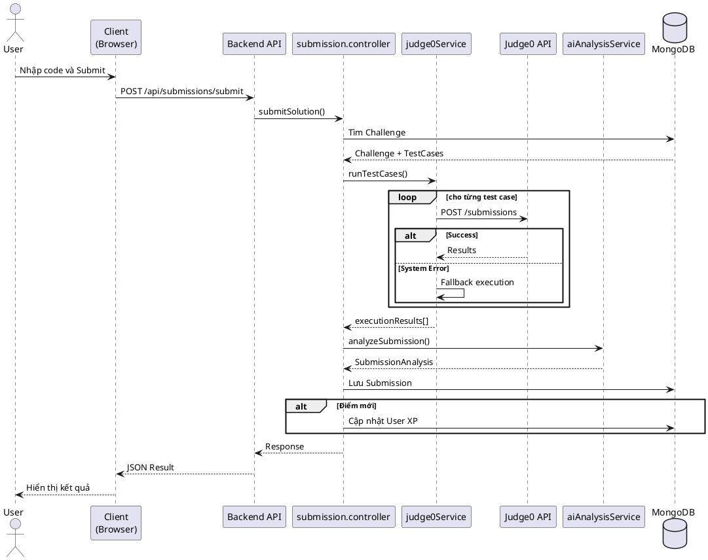
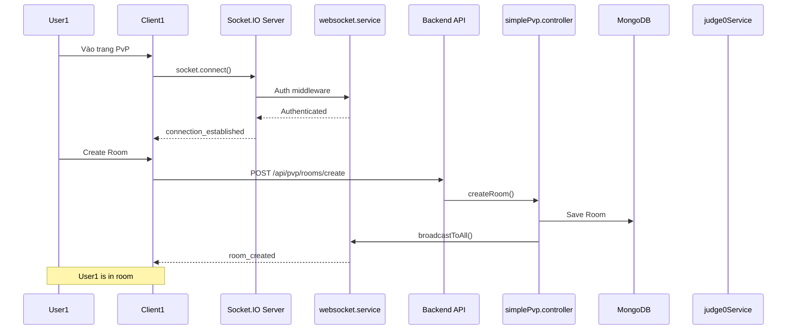
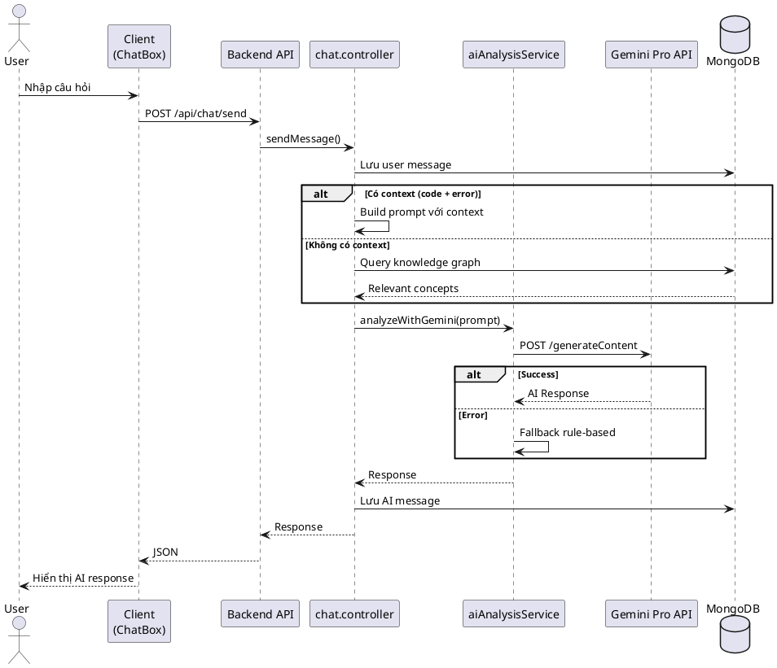

# Hướng dẫn vẽ Sequence Diagram cho BugHunter

Tài liệu này cung cấp hướng dẫn chi tiết để vẽ các sơ đồ tuần tự (sequence diagram) cho 3 luồng tương tác chính của hệ thống BugHunter.

---

## 1. Luồng tương tác: Submit Code với Judge0

### Mô tả
Luồng này mô tả quá trình user submit code để chấm bài, từ frontend gửi request đến backend xử lý với Judge0 API, sau đó phân tích kết quả và trả về cho user.

### Các thành phần (Actors & Components)
1. **User** - Người dùng
2. **Client (Browser)** - Giao diện web React
3. **Backend API** - Server Node.js/Express
4. **submission.controller** - Controller xử lý submission
5. **judge0Service** - Service tương tác với Judge0
6. **Judge0 API** - API Judge0 (self-hosted hoặc cloud)
7. **aiAnalysisService** - Service phân tích kết quả với AI
8. **Database (MongoDB)** - Lưu trữ submissions
9. **Notification Service** - Gửi thông báo

### Sequence Diagram

```
User -> Client: Nhập code và nhấn "Submit"
Client -> Backend API: POST /api/submissions/submit
Note: Request body: { challengeId, code, language }

Backend API -> submission.controller: submitSolution(req, res)
submission.controller -> Database: Tìm Challenge theo ID
Database --> submission.controller: Trả về Challenge + TestCases

submission.controller -> judge0Service: runTestCases(code, language, testCases)
judge0Service -> Judge0 API: POST /submissions (cho từng test case)
Note: Judge0 request: { source_code, language_id, stdin, expected_output }

alt Judge0 chạy thành công
    Judge0 API --> judge0Service: Kết quả: { stdout, stderr, status, time, memory }
    judge0Service --> submission.controller: executionResults[]
else Judge0 gặp lỗi hệ thống (status 13)
    Judge0 API --> judge0Service: Lỗi: Internal Error
    judge0Service -> judge0Service: Fallback: Chạy code local với spawn()
    judge0Service --> submission.controller: executionResults[] (từ fallback)
end

submission.controller -> submission.controller: Tính điểm score
submission.controller -> aiAnalysisService: analyzeSubmission(options)
aiAnalysisService -> aiAnalysisService: Phân tích lỗi, tạo gợi ý

alt Có Gemini API Key
    aiAnalysisService -> Gemini API: POST /generate
    Gemini API --> aiAnalysisService: AI Analysis JSON
end

aiAnalysisService --> submission.controller: SubmissionAnalysis
submission.controller -> Database: Tạo Submission document
Database --> submission.controller: Submission saved

alt User đạt điểm mới (chưa pass trước đó)
    submission.controller -> Database: Cập nhật User (XP, progress)
    Database --> submission.controller: User updated
    submission.controller -> submission.controller: updateUserRank()
    
    opt Rank up
        submission.controller -> Notification Service: notifyRankUp()
    end
    
    submission.controller -> Notification Service: notifyChallengeCompleted()
end

submission.controller --> Backend API: Response với analysis
Backend API --> Client: JSON: { success, submission, analysis }
Client -> Client: Hiển thị kết quả, score, gợi ý
Client --> User: Feedback UI (Pass/Fail, AI suggestions)
```

### Các điểm quan trọng cần thể hiện:
1. **Judge0 Fallback**: Khi Judge0 gặp lỗi hệ thống (status 13), hệ thống tự động fallback sang chạy code local
2. **AI Analysis**: Sử dụng Gemini API nếu có, không thì dùng rule-based analysis
3. **XP & Rank**: Chỉ cộng XP và cập nhật rank khi user đạt điểm mới (chưa pass trước đó)
4. **Multiple Test Cases**: Judge0 chạy từng test case riêng biệt, delay 500ms giữa các request
5. **Code Wrapping**: judge0Service tự động wrap user code để có thể đọc input và gọi hàm

### Công cụ vẽ đề xuất:
- **PlantUML**: https://plantuml.com/
- **Mermaid**: https://mermaid.js.org/
- **Draw.io**: https://app.diagrams.net/
- **Lucidchart**: https://www.lucidchart.com/

### Ví dụ PlantUML code:


---

## 2. Luồng tương tác: Real-time PvP với Socket.IO

### Mô tả
Luồng này mô tả quá trình 2 user tham gia vào một trận đấu PvP real-time, từ tạo/join room, đến chạy bài tập, submit code, và xác định winner.

### Các thành phần (Actors & Components)
1. **User 1** - Người chơi 1 (Host)
2. **User 2** - Người chơi 2 (Guest)
3. **Client 1** - Giao diện của User 1
4. **Client 2** - Giao diện của User 2
5. **Socket.IO Server** - WebSocket server
6. **websocket.service** - Service quản lý rooms và matches
7. **Backend API** - REST API server
8. **simplePvp.controller** - Controller xử lý PvP
9. **judge0Service** - Service chấm code
10. **Database (MongoDB)** - Lưu trữ rooms và submissions

### Sequence Diagram

```
== Khởi tạo kết nối ==
User1 -> Client1: Đăng nhập và vào trang PvP
Client1 -> Socket.IO Server: socket.connect({ auth: { token } })
Socket.IO Server -> websocket.service: Authentication middleware
websocket.service --> Socket.IO Server: User authenticated
Socket.IO Server -> websocket.service: connection event
websocket.service -> websocket.service: Thêm user vào onlineUsers Map
Socket.IO Server --> Client1: connection_established event
Note: Payload: { user, onlineUsers, rooms }

User2 -> Client2: Đăng nhập và vào trang PvP
Client2 -> Socket.IO Server: socket.connect({ auth: { token } })
Socket.IO Server -> websocket.service: Authentication + connection
websocket.service -> websocket.service: Thêm user vào onlineUsers Map
Socket.IO Server --> Client2: connection_established event
Socket.IO Server --> Client1: user_online event (User2)

== Tạo Room ==
User1 -> Client1: Nhấn "Create Room"
Client1 -> Backend API: POST /api/pvp/rooms/create
Backend API -> simplePvp.controller: createRoom()
simplePvp.controller -> Database: Tạo Room document
Database --> simplePvp.controller: Room saved
simplePvp.controller -> websocket.service: broadcastToAll('room_created')
websocket.service --> Socket.IO Server: Emit 'room_created' to all
Socket.IO Server --> Client1: room_created event
Socket.IO Server --> Client2: room_created event
Client1 -> Client1: Hiển thị "You are in the room"
Client2 -> Client2: Cập nhật danh sách rooms

== Join Room ==
User2 -> Client2: Nhấn "Join Room"
Client2 -> Backend API: POST /api/pvp/rooms/:roomId/join
Backend API -> simplePvp.controller: joinRoom()
simplePvp.controller -> Database: Cập nhật Room (thêm participant)
Database --> simplePvp.controller: Room updated
simplePvp.controller -> websocket.service: broadcastRoomUpdate(room)
websocket.service --> Socket.IO Server: Emit 'room_updated' to all
Socket.IO Server --> Client1: room_updated event
Socket.IO Server --> Client2: room_updated event
Client1 -> Client1: Hiển thị "User2 joined"
Client2 -> Client2: Hiển thị "You joined room"

== Bắt đầu Match ==
User1 -> Client1: Nhấn "Ready"
Client1 -> Backend API: PUT /api/pvp/rooms/:roomId/ready
Backend API -> simplePvp.controller: setReady()
simplePvp.controller -> Database: Cập nhật participant.isReady = true

User2 -> Client2: Nhấn "Ready"
Client2 -> Backend API: PUT /api/pvp/rooms/:roomId/ready
simplePvp.controller -> simplePvp.controller: Kiểm tra tất cả ready
alt Tất cả đã ready
    simplePvp.controller -> simplePvp.controller: Chọn bài tập ngẫu nhiên
    simplePvp.controller -> Database: Cập nhật Room (status: 'in-progress', startTime)
    simplePvp.controller -> websocket.service: broadcastRoomTimerSync()
    websocket.service --> Socket.IO Server: Emit 'room_timer_sync'
    Socket.IO Server --> Client1: room_timer_sync event
    Socket.IO Server --> Client2: room_timer_sync event
    Client1 -> Client1: Start countdown timer
    Client2 -> Client2: Start countdown timer
end

== Submit Code (User 1) ==
User1 -> Client1: Viết code và Submit
Client1 -> Backend API: POST /api/pvp/rooms/:roomId/submit
Backend API -> simplePvp.controller: submitCodeInRoom()
simplePvp.controller -> Database: Tìm Challenge
simplePvp.controller -> judge0Service: runTestCases()
judge0Service -> Judge0 API: Chấm code
Judge0 API --> judge0Service: Results
judge0Service --> simplePvp.controller: executionResults[]
simplePvp.controller -> Database: Tạo PvpSubmission
simplePvp.controller -> websocket.service: broadcastRoomUpdate()
websocket.service --> Socket.IO Server: Emit 'room_updated'
Socket.IO Server --> Client1: room_updated event
Socket.IO Server --> Client2: room_updated event
Client1 -> Client1: Hiển thị kết quả của User1
Client2 -> Client2: Hiển thị "User1 submitted"

== Submit Code (User 2) ==
User2 -> Client2: Viết code và Submit
Client2 -> Backend API: POST /api/pvp/rooms/:roomId/submit
simplePvp.controller -> judge0Service: runTestCases()
judge0Service --> simplePvp.controller: executionResults[]
simplePvp.controller -> simplePvp.controller: Kiểm tra tất cả đã submit
alt Tất cả đã submit hoặc hết giờ
    simplePvp.controller -> simplePvp.controller: calculateWinner()
    simplePvp.controller -> Database: Cập nhật Room (status: 'completed', winner)
    simplePvp.controller -> Database: Cập nhật User stats
    simplePvp.controller -> websocket.service: broadcastRoomUpdate()
    websocket.service --> Socket.IO Server: Emit 'room_updated'
    Socket.IO Server --> Client1: room_updated event
    Socket.IO Server --> Client2: room_updated event
    Client1 -> Client1: Hiển thị kết quả cuối cùng
    Client2 -> Client2: Hiển thị kết quả cuối cùng
end

User1 -> Client1: Xem kết quả winner
User2 -> Client2: Xem kết quả winner
```

### Các điểm quan trọng cần thể hiện:
1. **Socket.IO Authentication**: Token-based auth qua middleware trước khi kết nối
2. **Real-time Updates**: Tất cả thay đổi room được broadcast đến tất cả clients qua Socket.IO
3. **Room Lifecycle**: waiting → in-progress → completed
4. **Timer Sync**: Server gửi startTime, client tự countdown để tránh desync
5. **Winner Calculation**: Dựa trên score, nếu bằng thì xét executionTime
6. **Concurrent Submissions**: Hệ thống xử lý khi nhiều user submit cùng lúc

### Công cụ vẽ đề xuất:
- **PlantUML**: Tốt cho sequence diagram phức tạp với nhiều actors
- **Mermaid**: Tích hợp tốt với Markdown và GitHub
- **Draw.io**: Giao diện kéo thả trực quan

### Ví dụ Mermaid code:


---

## 3. Luồng tương tác: AI Debug Assistant

### Mô tả
Luồng này mô tả quá trình user sử dụng AI Debug Assistant (chatbot) để nhận gợi ý về code, lỗi, hoặc giải pháp cho bài tập. Hệ thống sử dụng Gemini Pro AI để phân tích và trả lời.

### Các thành phần (Actors & Components)
1. **User** - Người dùng
2. **Client (Browser)** - Giao diện web với ChatBox component
3. **Backend API** - Server Node.js/Express
4. **chat.controller** - Controller xử lý chat
5. **aiAnalysisService** - Service tương tác với AI
6. **Gemini Pro API** - Google Generative AI
7. **knowledgeGraphService** - Service xây dựng knowledge graph từ training data
8. **Database (MongoDB)** - Lưu trữ chat history và training data

### Sequence Diagram

```
== Khởi tạo Chat ==
User -> Client: Mở ChatBox
Client -> Backend API: GET /api/chat/history?challengeId={id}
Backend API -> chat.controller: getChatHistory()
chat.controller -> Database: Tìm chat history của user + challenge
Database --> chat.controller: Chat messages[]
chat.controller --> Backend API: Response
Backend API --> Client: JSON: { messages }
Client -> Client: Hiển thị chat history
Client --> User: ChatBox với history

== Gửi Message ==
User -> Client: Nhập câu hỏi và gửi
Note: Ví dụ: "Tại sao code của tôi bị lỗi IndexError?"

Client -> Backend API: POST /api/chat/send
Note: Request: { challengeId, message, context: { code, language, error } }

Backend API -> chat.controller: sendMessage()
chat.controller -> Database: Lưu user message
chat.controller -> chat.controller: Xây dựng prompt cho AI

alt Có context (code + error)
    chat.controller -> chat.controller: Thêm code snippet vào prompt
    chat.controller -> aiAnalysisService: analyzeWithGemini()
else Không có context
    chat.controller -> knowledgeGraphService: Tìm relevant concepts
    knowledgeGraphService -> Database: Query training data
    Database --> knowledgeGraphService: Relevant concepts
    knowledgeGraphService --> chat.controller: Context hints
end

chat.controller -> aiAnalysisService: Gửi prompt đến Gemini
aiAnalysisService -> Gemini Pro API: POST /generateContent
Note: Model: gemini-pro hoặc gemini-1.5-flash

alt Gemini API thành công
    Gemini Pro API --> aiAnalysisService: AI Response text
    aiAnalysisService -> aiAnalysisService: Parse và validate response
    aiAnalysisService --> chat.controller: AI message
else Gemini API lỗi (rate limit, invalid key, etc.)
    Gemini Pro API --> aiAnalysisService: Error
    aiAnalysisService -> aiAnalysisService: Fallback: Rule-based response
    aiAnalysisService --> chat.controller: Fallback message
end

chat.controller -> Database: Lưu AI response
Database --> chat.controller: Message saved

chat.controller --> Backend API: Response
Backend API --> Client: JSON: { message, aiResponse }

Client -> Client: Hiển thị AI response trong ChatBox
Client --> User: Feedback với code suggestions, hints

== Follow-up Question ==
User -> Client: Hỏi follow-up
Client -> Backend API: POST /api/chat/send
chat.controller -> Database: Lấy chat history
chat.controller -> chat.controller: Xây dựng prompt với history context
chat.controller -> aiAnalysisService: analyzeWithGemini(history)
aiAnalysisService -> Gemini Pro API: POST /generateContent
Note: Prompt bao gồm previous messages cho context

Gemini Pro API --> aiAnalysisService: Contextual response
aiAnalysisService --> chat.controller: AI message
chat.controller -> Database: Lưu message
chat.controller --> Client: Response
Client --> User: Hiển thị contextual answer

== Debug Specific Error ==
User -> Client: Submit code bị lỗi
Client -> Backend API: POST /api/submissions/submit
Backend API -> submission.controller: submitSolution()
submission.controller -> judge0Service: runTestCases()
judge0Service --> submission.controller: executionResults (có lỗi)
submission.controller -> aiAnalysisService: analyzeSubmission()
aiAnalysisService -> Gemini Pro API: Phân tích lỗi với prompt chi tiết
Gemini Pro API --> aiAnalysisService: Error analysis + suggestions
aiAnalysisService --> submission.controller: SubmissionAnalysis
submission.controller --> Backend API: Response với analysis
Backend API --> Client: JSON: { analysis, codeSuggestions }

Client -> Client: Hiển thị error analysis trong Result UI
opt User click "Ask AI about this error"
    Client -> Backend API: POST /api/chat/send
    Note: Message: "Giải thích lỗi này" + context: error details
    Backend API -> chat.controller: sendMessage()
    chat.controller -> aiAnalysisService: analyzeWithGemini()
    aiAnalysisService -> Gemini Pro API: Explain error
    Gemini Pro API --> aiAnalysisService: Detailed explanation
    aiAnalysisService --> chat.controller: AI message
    chat.controller --> Client: Response
    Client -> Client: Hiển thị explanation trong ChatBox
end

Client --> User: Gợi ý sửa lỗi chi tiết
```

### Các điểm quan trọng cần thể hiện:
1. **Context-Aware**: AI nhận context từ code, error message, và chat history
2. **Multi-Model Fallback**: Thử gemini-pro → gemini-1.5-flash → gemini-1.5-pro nếu lỗi
3. **Rule-Based Fallback**: Nếu tất cả AI models đều lỗi, dùng rule-based analysis
4. **Knowledge Graph**: Sử dụng training data để tìm relevant concepts cho câu hỏi
5. **Persistent History**: Chat history được lưu trong database, load lại khi user quay lại
6. **Error Analysis Integration**: Kết hợp với submission analysis để cung cấp gợi ý chi tiết

### Các loại prompt AI xử lý:
- **Code Debugging**: "Tại sao code của tôi bị lỗi?"
- **Concept Explanation**: "Giải thích thuật toán Binary Search"
- **Solution Hints**: "Gợi ý cách giải bài này"
- **Error Analysis**: "Giải thích lỗi IndexError"
- **Code Review**: "Code của tôi có vấn đề gì?"

### Công cụ vẽ đề xuất:
- **PlantUML**: Tốt cho sequence diagram với nhiều luồng điều kiện
- **Mermaid**: Tích hợp tốt với Markdown
- **Draw.io**: Giao diện trực quan

### Ví dụ PlantUML code:


---

## Tổng kết

### So sánh 3 luồng:

| Đặc điểm | Submit Code | Real-time PvP | AI Debug Assistant |
|---------|-------------|---------------|-------------------|
| **Protocol** | HTTP REST | Socket.IO (WebSocket) + REST | HTTP REST |
| **Real-time** | Không | Có (room updates, submissions) | Không |
| **AI Integration** | Có (analysis sau submit) | Không (chỉ chấm code) | Có (chat với Gemini) |
| **Judge0** | Có (chấm code) | Có (chấm code cho cả 2 players) | Không |
| **Complexity** | Medium | High | Medium |
| **Main Service** | judge0Service, aiAnalysisService | websocket.service, judge0Service | aiAnalysisService, knowledgeGraphService |

### Tips khi vẽ Sequence Diagram:
1. **Sử dụng alt/opt/loop** để thể hiện luồng điều kiện
2. **Note** để giải thích payload hoặc logic quan trọng
3. **Nhóm các bước** bằng box hoặc frame để dễ đọc
4. **Màu sắc**: Phân biệt success (xanh) và error (đỏ) flows
5. **Naming**: Đặt tên actors và components rõ ràng
6. **Độ chi tiết**: Cân bằng giữa chi tiết và dễ hiểu

### Công cụ online miễn phí:
- **PlantUML Online**: https://www.plantuml.com/plantuml/uml/
- **Mermaid Live Editor**: https://mermaid.live/
- **Draw.io**: https://app.diagrams.net/
- **SequenceDiagram.org**: https://sequencediagram.org/

---

## Phụ lục: Các event Socket.IO quan trọng

### WebSocket Events (PvP):
- **connection_established**: Client kết nối thành công
- **user_online**: User khác vào online
- **user_offline**: User khác offline
- **room_created**: Room mới được tạo
- **room_updated**: Room có thay đổi
- **room_deleted**: Room bị xóa
- **room_timer_sync**: Đồng bộ timer cho match
- **user_joined_room**: User join room
- **user_left_room**: User leave room
- **submission_received**: User submit code trong PvP

### HTTP Endpoints:
- `POST /api/submissions/submit` - Submit code để chấm
- `POST /api/pvp/rooms/create` - Tạo PvP room
- `POST /api/pvp/rooms/:roomId/join` - Join room
- `POST /api/pvp/rooms/:roomId/submit` - Submit code trong room
- `POST /api/chat/send` - Gửi message đến AI chatbot
- `GET /api/chat/history` - Lấy chat history

---

**Lưu ý**: Các sơ đồ trên đã được đơn giản hóa để dễ hiểu. Trong thực tế, hệ thống có thể có thêm các bước middleware, error handling, và logging không được thể hiện chi tiết.
